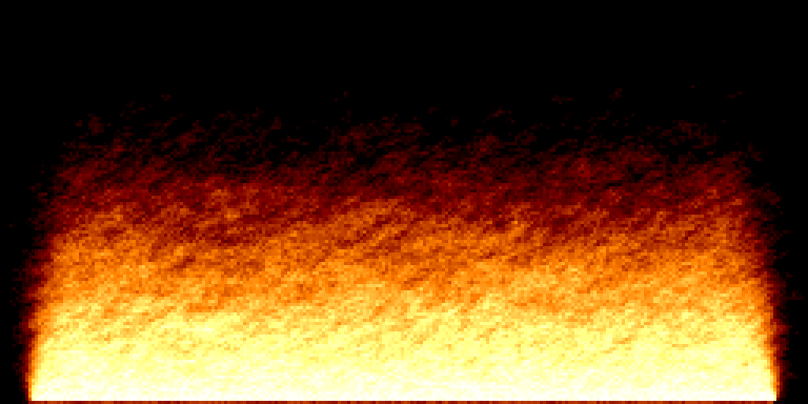

# From Pixelflow Canvas to PixelRAM: fire


{: .img-fluid }

The fire demo is the intended bridge between Pixelflow Canvas and PixelRAM. The interesting part of the algorithm barely changes.

## Pixelflow Canvas

```ruby
c = get_pixel(x, y + 1) * 2
c += get_pixel(x - 1, y)
c += get_pixel(x + 1, y)
c /= 4

c += rand(7) - 3 if c > 0
c = c.clamp(0, 63)

set_pixel(x, y, c)
```

## PixelRAM

```c
int c = get_pixel(x, y + 1) * 2;
c += get_pixel(x - 1, y);
c += get_pixel(x + 1, y);
c /= 4;

if (c > 0)
    c += rand() % 7 - 3;

c = clamp_int(c, 0, 63);
set_pixel(x, y, (uint8_t)c);
```

Both versions work on palette indices rather than RGB colors. The lower rows are repeatedly heated to color 63, and each new pixel is calculated from nearby pixels. Small random changes make the flame unstable.

The complete C program is `examples/fire.c`.

## The fire palette

The example replaces the first 64 palette entries with a heat gradient:

```c
for (int i = 0; i < 16; i++)
{
    set_palette(i,      i * 8,       0,           0);
    set_palette(i + 16, i * 8 + 128, i * 8,      0);
    set_palette(i + 32, 255,         i * 8 + 128, i * 8);
    set_palette(i + 48, 255,         255,         i * 8 + 128);
}
```

The framebuffer still contains only numbers from 0 to 63. The palette determines how hot each number looks.

{: .note }
The update is intentionally performed in place, just like the Ruby version. During a left-to-right scan, the pixel to the left may already contain its new value while the pixel to the right still contains its old value. Changing to a second buffer changes the effect slightly.
